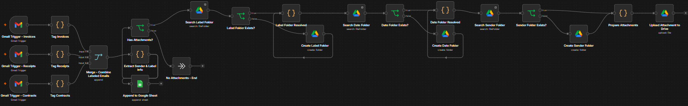

# Multi-Label Gmail to Google Sheets & Drive Automation

An n8n workflow that monitors a Gmail inbox across multiple labels, logs incoming emails to Google Sheets, and automatically archives attachments to Google Drive in a clean `Label / Date / Sender` folder structure — with original filenames preserved.



## Demo Video

[Watch a walkthrough](https://drive.google.com/file/d/1thr2ubobUQX-ORGvnXoJsmxaGblf6I7b/view?usp=sharing)

## Live Examples

- 📊 [View the Google Sheet](https://docs.google.com/spreadsheets/d/1r3PEzvA6geWtYVOoZV37VK-Ridy2AnU5WBxTPbvprW4/edit?usp=sharing)
- 📁 [View the Drive folder](https://drive.google.com/drive/folders/1VYLk_XSq6Rx2aR1KW1eHwZ2o7BJxQvnU?usp=drive_link)

## What it does

- **Polls Gmail every minute** across three labels: `Invoices`, `Receipts`, and `Contracts`
- **Extracts sender info** (name, email, subject, date received) from each matching email and appends it as a row in a Google Sheet
- **Downloads any attachments** to Google Drive, keeping each file's original filename
- **Auto-organizes attachments** into a nested folder structure — `Label → Date Received → Sender Name` — creating folders on demand if they don't already exist, and reusing them if they do
- **Converts received dates to Philippine local time** so folder dates match the local calendar day rather than UTC

## Example output structure

```
Google Drive Root/
└── Receipts/
    └── 2026-09-06/
        └── Christian Joshua Alberto/
            └── receipt.pdf
```

## How it works

Three separate Gmail Trigger nodes (one per label) keep the label-matching simple and explicit — each just watches its own Gmail search query (`label:Invoices`, `label:Receipts`, `label:Contracts`). Each stream is tagged with its label, merged into a single pipeline, and then:

1. **Extract Sender & Label Info** — parses the sender, subject, date, and attachment count from the raw Gmail message object, converting the received date to Asia/Manila local time
2. **Append to Google Sheet** — logs every processed email as a row, regardless of whether it has attachments
3. **Has Attachments?** — branches the workflow; emails with no attachments end immediately
4. **Folder resolution chain** — for each of Label, Date, and Sender, the workflow searches Google Drive for an existing folder with that name and either reuses it or creates it, nesting each level inside the last
5. **Upload Attachment to Drive** — uploads each attachment into the resolved sender folder, using its original filename

### Design notes

- Using one Gmail Trigger per label (rather than a single trigger with a combined query and a separate label-name lookup) keeps the logic simple and avoids relying on Gmail's internal label IDs
- Small "anchor" nodes (`Label Folder Resolved`, `Date Folder Resolved`) preserve each parent folder's ID across the Drive search steps, so newly-created subfolders are always nested under the correct parent — this matters because a Drive search node's output fully replaces the item data, which otherwise loses the parent reference
- Drive folder searches use "Always Output Data" so a "folder doesn't exist yet" result (zero items) doesn't silently halt that branch of the workflow
- Sheet logging and attachment handling run as two independent branches off the same extraction step, so an issue in one never affects the other

## Tech stack

- [n8n](https://n8n.io/) (workflow automation)
- Gmail API
- Google Sheets API
- Google Drive API

## Setup

1. Import `gmail-document-organizer.json` into your n8n instance
2. Connect your Gmail, Google Sheets, and Google Drive OAuth2 credentials on the respective nodes
3. Update the Google Sheet ID and tab in the **Append to Google Sheet** node
4. Update the root Google Drive folder ID in the **Search Label Folder** and **Create Label Folder** nodes
5. Make sure your Gmail account has labels named `Invoices`, `Receipts`, and `Contracts` (or edit the trigger queries and label-tagging nodes to match your own label names)
6. Activate the workflow

## License

MIT
